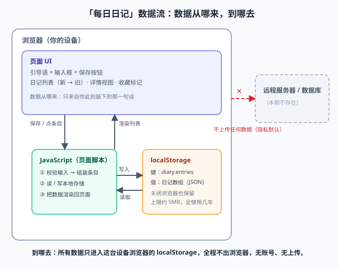

# TECH_DESIGN.md ·「每日日记」技术设计

> v1｜2026-09-28（Day 5）
> 一句话：用最少的零件把 PRD 的理念造出来——数据不出浏览器，代码不需要构建，页面不需要服务器。

## 1. 一句话技术路线

**纯前端静态单页：HTML + CSS + 原生 JavaScript，数据存浏览器 localStorage，免费托管在 GitHub Pages——没有后端、没有数据库、没有构建工具。**

## 2. 为什么选它（每条理由都对着 PRD）

| PRD 要求（v2） | 技术选择 | 为什么成立 |
|---|---|---|
| 数据只存浏览器本地，不上传任何服务器（§1 理念 2、F5） | localStorage | 浏览器自带、无需安装任何东西，关浏览器数据仍在，天然满足「隐私默认」 |
| 无账号体系、无登录环节（F5） | 纯前端静态页 | 没有后端就没有账号这件事，不是「不做」而是「不存在」 |
| 有公网 URL，可直接访问（§8 整体） | GitHub Pages | 仓库（beliyaop/my-website）已经存在，开一个设置就有免费 HTTPS 域名，部署 = push |
| 单页两个视图、数据量小（§5、§7） | 原生 JS，无框架 | 两个视图 + 一个数组，框架要解决的「复杂状态管理」这里不存在 |
| 手机 375px + 桌面窄栏（§5） | 原生 CSS（flex + max-width） | 一列布局是最简单的响应式场景，不需要 CSS 框架 |
| 初学者 30 天学习计划 | 最小技术集合 | 每个零件都能一句话讲清用途；Day 7 MVP 跑通后再评估要不要引入框架 |

## 3. 备选路线与不选的理由

| 备选 | 不选的核心原因 |
|---|---|
| React / Vue + 构建工具 | 解决的是复杂界面的状态管理，本页只有两个视图；代价是引入 node、npm、打包等一整套新概念，违背「每个零件可解释」 |
| 后端 + 数据库（如 Node + SQLite） | 与 PRD 核心理念「数据不上传服务器」直接冲突，还额外背上部署和运维成本 |
| IndexedDB（浏览器另一种本地存储） | 容量大但 API 是异步回调式，对初学者明显更难；一句话日记 5MB 的 localStorage 上限足够写很多年 |

> 结论：示范路线（纯前端 + localStorage）每一条都直接命中 PRD，暂不引入更重的方案；等「导出/云同步」这类后续功能真要做时再重新评估（见 §6）。

## 4. 数据怎么存

- **存储位置**：浏览器 `localStorage`
- **键名**：`diary.entries`（一个键存全部日记）
- **值**：JSON 数组，每个元素对应 PRD §6 的一条日记：

```json
{
  "id": "a1b2c3",
  "date": "2026-09-28",
  "text": "今天学会给 PRD 写验收标准",
  "favorite": false,
  "createdAt": "2026-09-28T22:30:00"
}
```

- **写规则**（保存）：读出数组 → 头部插入新条目 → 写回（无后端，不存在并发冲突）
- **读规则**（渲染）：读数组 → 按 `date` + `createdAt` 倒序排列 → 画到页面
- **异常对应 PRD §7**：localStorage 不可用（隐私模式）→ 显示「当前浏览器无法保存日记」；写入失败（空间满）→ 明确提示，不静默丢失

## 5. 数据流图



文字版一句话：**数据从「你在输入框敲下的一句话」来，经页面脚本组装成条目，写进浏览器的 localStorage；页面每次打开再从 localStorage 读出来、渲染成列表——起点是你，终点是你这台设备的浏览器，中间不经过任何服务器。**

## 6. 方案变化时哪些文件会受影响（余力加练）

| 如果未来要… | 受影响文件 | 影响方式 |
|---|---|---|
| 换存储引擎（IndexedDB / 导出文件） | TECH_DESIGN.md §4、index.html 中读写数据的函数 | 只改「读写层」，UI 渲染不变 |
| 加登录 + 云同步（后续第 9 项） | TECH_DESIGN.md、PRD.md、index.html、新增 server/ 目录 | 范围最大：隐私说明要改、需引入后端与账号 |
| 换托管平台（GitHub Pages → 其他） | 仓库设置、TECH_DESIGN.md §2 | 代码零改动，只换「门牌」 |
| 引入前端框架 | index.html、新增构建配置文件 | 整页重写，建议 MVP 验证后再评估 |
| 改一条日记的字段（如加心情） | TECH_DESIGN.md §4、PRD.md §6、index.html | 三处同步：设计、需求、实现 |

## 7. 技术栈小抄（余力加练：网页开发用到哪些技术，各有什么用）

| 技术 | 一句话作用 | 优势 | 劣势 |
|---|---|---|---|
| HTML | 骨架：页面上有什么东西 | 简单、必学、所有浏览器都认 | 只管结构，不好看也不会动 |
| CSS | 皮肤：东西长什么样、怎么排版 | 直接控制外观，手机桌面通吃 | 写多了容易乱，需靠约定管理 |
| JavaScript | 肌肉：东西怎么动、怎么响应点击 | 浏览器原生运行，前后端都能用 | 原生写法在大项目里易失控（所以要框架） |
| localStorage | 浏览器自带的小仓库：存少量数据 | 零配置、同步 API 简单、自动持久 | 上限约 5MB、只能存字符串、不同浏览器不同步 |
| Git | 时光机：记录每次改动，随时回退 | 免费、离线可用、协作标配 | 概念（分支/合并）对初学者有门槛 |
| GitHub Pages | 免费门牌：把仓库变成公网网址 | 零成本、自动部署（push 即上线） | 只适合静态页，不能跑后端 |

> 本期技术栈 = HTML + CSS + JavaScript + localStorage + Git + GitHub Pages，共六个零件，每个都能一句话讲清。

## 附录 · 修订记录

| 日期 | 版本 | 修订 | 原因 |
|---|---|---|---|
| 2026-09-28 | v1 | 首次成稿：锁定技术路线、存储方案、数据流图 | Day 5 任务 |
